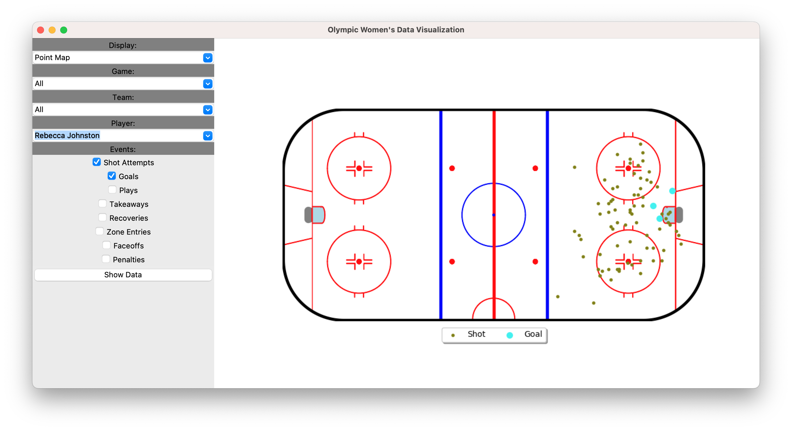

# Olympic Women's Hockey Data Visualization App

## Introduction

This app offers 3 different ways to view hockey data:
    - Individual event details in a table
    - Player-aggregated stats in a table
    - Individual event details in plotted on a rink

The data can be from an individual game or the whole tournament included in the dataset.

## Requirements
Python Packages:
- pandas
- tk-tools
- tkinter
- pandastable
- pandas
- numpy
- matplotlib
- hockey_rink

## How to Use

### Startup

To run the app, simply execute the statviz_main.py file in an environment with the libraries installed.

```
python statviz_main.py
```

 This will start the reading of the data from a csv into a pandas dataframe. After the data is loaded the app will start and will display the following:


The user may now select which type of data they'd like to see by game, team and player.

### Showing data

Combobox values will dynamically change depending on the box above's value. If you choose a game featuring Canada, them and their opponent will be the only ones available to choose, as well as their players.

Individual events with their relevant details can be selected from the menu and displayed in a sortable pandas table. You can choose to have as many events as you would like.


Aggregate stats are also available, this will group events by player into sums of events and some percentages as well.


Finally, individual events can be plotted to see where they took place on the ice. All varieties of event can be displayed as well all of whatever combination of game, team, and player is desired.




## Improvements

Since this is a simple demo I didn't go too far into the weeds of the data being presented, but if I were to do this project again with more time I'd consider the following improvements:

- Subselections for the larger categories (ie. On Net, Blocked and Missed for Shot Attempts)
- Improved point plots with selectable nodes to see event details
- A better UI library than tkinter (this is just what I was most familiar with)
- Improved aggregate stats, things like distance from net for shot attempts


